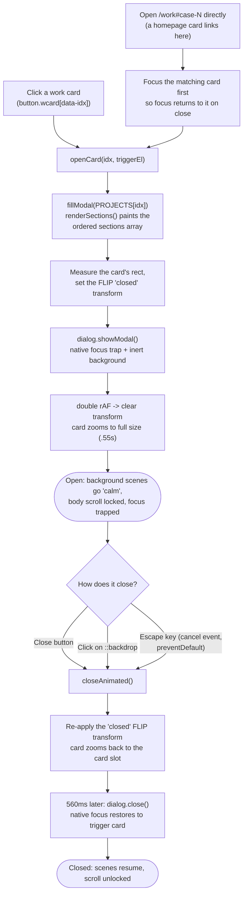
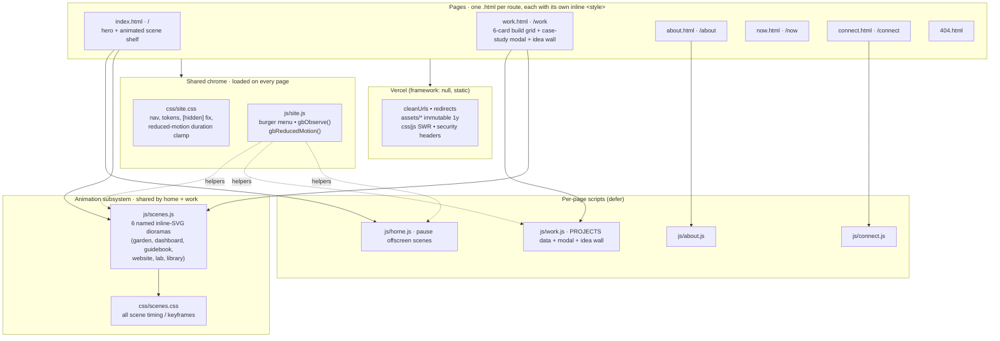

# georgeellisbrothers.com

A personal portfolio site that behaves like a small interactive product instead of a
template. Every project card is a hand-drawn animated scene, and clicking one zooms it
open into a full case study without a page load. It is plain HTML, CSS, and vanilla
JavaScript. **No framework, no build step, no npm dependencies.** That constraint is the
whole point, and the site is the proof it holds up.

**Live: [georgeellisbrothers.com](https://georgeellisbrothers.com)**. The site *is* the
deliverable, so start there.

<!-- SCREENSHOT: home page hero at ~1440px: the "An accounting brain that ships the software." headline over the desk photo, with the scene-card shelf below -->
> _Above: the home hero and the animated scene-card shelf._

---

> **A note on this repository.** This is a public mirror of a site I designed, built, and
> ship myself. The only things held back from the mirror are the original full-resolution
> photography (`photos-originals/`) and my private authoring notes; everything that runs in
> the browser is here. I designed the layout, animation, and interaction model, built and
> tested the implementation with AI-assisted development tools, and can walk through the
> code, the tradeoffs, and the current limitations line by line.

---

## Why it is built this way

Most portfolio sites reach for a framework and a build pipeline before they have a single
page worth showing. I went the other direction on purpose. The site is six static HTML
files, two shared stylesheets, and a handful of small vanilla-JS scripts loaded with
`<script defer>`. There is nothing to `npm install`, nothing to transpile, and nothing to
break between commit and deploy. What ships to the browser is exactly what is in the repo.

That constraint is not laziness. It forced every interesting behavior (the animated
scenes, the zoom-open case-study modal, the deep links) to be built by hand against the
platform, which is a more honest demonstration of front-end craft than wiring up a
component library. The bet is that taste and restraint read louder than a dependency list.

## How the case-study modal works

The center of the site is the work grid: six project cards that open into full case
studies. There is no separate detail page. A native `<dialog>` element animates open from
the exact position of the card you clicked, using a FLIP (First-Last-Invert-Play)
transform, and it can also be opened directly by URL so a link can point at one project.



Everything worth pointing at in that diagram is a deliberate accessibility or polish
decision:

- **Native `<dialog>` + `showModal()`** gives a real focus trap and an inert background for
  free, instead of a hand-rolled and usually-buggy one. `js/work.js` leans on the platform
  rather than reimplementing it.
- **Escape is intercepted, not blocked.** A native dialog closes instantly on Escape, which
  would clip the zoom-out. The `cancel` event is caught with `preventDefault()` so Escape
  runs the same reverse-FLIP animation as every other close path. Keyboard users get the
  full polish, not a jump cut.
- **Focus returns to where you were.** On close, the native dialog restores focus to the
  element that was focused when it opened. For deep links there was no such element, so the
  code focuses the target card *before* calling `showModal()`, so a `/work#case-N` visit
  still returns focus into the grid, not to `document.body`.
- **The background calms down while open.** Opening the modal flips the grid to a `calm`
  motion state and pauses offscreen scenes, so nothing animates behind the case study.

<!-- SCREENSHOT: an open case-study modal at ~1440px: e.g. the Lucy or Context Drop case study zoomed open over the dimmed grid -->
> _Above: a case study zoomed open over the dimmed work grid._

## Architecture

Six pages, one shared chrome layer, and one animation subsystem that both the home page and
the work page pull from. Vercel serves the static files directly with clean URLs and a
tuned cache and security header policy.



`js/scenes.js` mounts each SVG scene into any `[data-scene]` host on the page, so the same
six illustrations render as small `mini` variants on the home shelf and as larger `full`
variants on the work grid. The home page and the work page never duplicate the artwork;
they both point at one registry.

## The hand-built scenes

The six cards are not GIFs or Lottie files. Each is a layered inline SVG "living diorama"
authored by hand in `js/scenes.js`, with every keyframe living in `css/scenes.css`. They
share one small behavior model:

- **Idle** is quiet ambient motion (a butterfly drifts, a plant sways).
- **Scrolling a card into view** plays one full narrative loop, then settles back to rest.
  Re-entering the viewport replays it.
- **Hover or keyboard focus** (on hover-capable devices) keeps the narrative looping until
  the pointer or focus leaves, ending cleanly on the next animation boundary rather than
  cutting mid-frame.
- **Offscreen cards pause** via a shared `IntersectionObserver` (`gbObserve` in
  `js/site.js`), so nothing animates where you cannot see it.
- **Reduced motion is respected globally.** A single duration-clamp in `css/site.css`
  neutralizes the loops, and `js/scenes.js` skips auto-play, rather than scattering
  `animation: none` overrides across the codebase.

<!-- SCREENSHOT: /work grid at ~1440px: the 6 animated project cards in the 4-column layout -->
> _Above: the work grid, six animated scene cards, each a button that opens a case study._

## The work grid, drawn as it behaves

The grid is a set of `<button>` cards; each opens the case study for its `data-idx`. Home
page cards are `<a href="/work#case-N">` links where `N` is that same index, so a project
is addressable by URL and the modal is the single source of truth for its content.

```
 WORK GRID (/work)                         CASE-STUDY MODAL (native <dialog>)
 ┌───────────┬───────────┐                 ┌─────────────────────────────────┐
 │ ▓ library │ ▒ garden  │   click card    │ 02 · MANDARIN            [ × ]   │
 │ Context…  │ Lucy      │  ─────────────▶ │ Lucy            [ BUILDING ]     │
 │ PROTOTYPE │ BUILDING  │   zoom-open     │ ───────────────────────────────  │
 ├───────────┼───────────┤   (FLIP .55s)   │ 01 · THE PROBLEM     …           │
 │ ▒ dashbd  │ ▒ guidebk │                 │ 02 · HOW IT WORKS    …           │
 │ atlas     │ AI for…   │                 │ 03 · ENGINEERING     • decisions │
 │ BUILD-RDY │ WRITING   │  ◀───────────── │ 04 · WHERE IT STANDS …           │
 ├───────────┼───────────┤   Esc / backdrop│ 05 · STACK  [tokens…]            │
 │ ▒ website │ ▒ lab     │   / close btn   │ ───────────────────────────────  │
 │ This site │ next one  │   zoom-back     │ [ View the repo ]  updated MAY26 │
 │ SHIPPED   │ OPEN SLOT │                 │ (PRIVATE REPO if no public repo) │
 └───────────┴───────────┘                 └─────────────────────────────────┘
   homepage cards deep-link in via /work#case-N   (N = data-idx, not slot number)
```

Each `PROJECTS` entry in `js/work.js` carries an ordered `sections` array of
`text` / `points` / `steps` / `stack` / `image` blocks that a single `renderSections()`
routine paints into the modal body. That is why a light "build log" project and a dense
engineering case study can share one modal with no per-project markup: the data describes
the shape, the renderer builds it. Projects with no public repo yet show a `PRIVATE REPO`
label and hide the repo button instead of linking to an empty repo.

## Engineering decisions

| Decision | Why |
|---|---|
| **Zero dependencies, no build step** | What ships is what is in the repo. Nothing to audit in `node_modules`, nothing to break in a pipeline, and every behavior is legible platform code. |
| **Native `<dialog>` over a custom modal** | The platform's focus trap and inert background are correct and free; a hand-rolled version is usually where the accessibility bugs live. |
| **One data-driven modal, not N detail pages** | `PROJECTS` + `renderSections()` means adding a project is a data edit, and every case study is guaranteed consistent. |
| **Deep-link index is the array index (`data-idx`), not the visual "01 ·" number** | New projects append to the array so existing `/work#case-N` links never shift. Only display numbers get renumbered. |
| **Immutable, versioned assets** | `assets/*` is cached for a year; a changed image becomes `.v2.` rather than overwriting `.v1.`, so caches never serve stale bytes. |
| **Motion is opt-out at one clamp, not per-animation** | Reduced-motion users are handled by a single CSS duration-clamp plus a JS auto-play skip, so the rule cannot be forgotten on a new scene. |
| **Inline per-page `<style>`, shared chrome extracted** | Each page is self-contained and fast to reason about; only genuinely shared CSS/JS lives in `site.*`. |

## What works today

- All six pages ship and are live at [georgeellisbrothers.com](https://georgeellisbrothers.com).
- Six hand-built animated scenes with scroll-in, hover/focus, offscreen-pause, and
  reduced-motion behavior.
- The zoom-open case-study modal with FLIP animation, focus trap, Escape/backdrop/button
  close paths, and focus restoration.
- Deep links: `/work#case-N` opens a specific case study and returns focus into the grid on
  close.
- The Idea Wall on `/work` and the contact form on `/connect` post to Formspree and confirm
  inline.
- Clean URLs, redirects, immutable asset caching, and security headers via `vercel.json`.

## What's next

- Real screenshots in this README (the placeholders above mark exactly what to capture).
- Fill the remaining `github` links in `PROJECTS` as those repos go public; until then they
  correctly show a `PRIVATE REPO` label.
- Continue tightening the mobile hero framing and 360px-width overflow (an ongoing manual
  check).

## Tech stack

- **HTML5.** One file per route, each with its own inline `<style>` block.
- **CSS.** `css/site.css` (shared chrome, tokens, reduced-motion clamp) and
  `css/scenes.css` (all scene animation timing). No preprocessor.
- **Vanilla JavaScript (ES2017).** Plain IIFEs loaded with `<script defer>`. No modules,
  no bundler, no dependencies.
- **Inline SVG.** The six animated scene illustrations.
- **Vercel.** Static hosting with `framework: null`, `cleanUrls`, redirects, and a
  cache/security header policy in `vercel.json`.

## Project layout

```
├── index.html          /        hero + animated scene shelf
├── work.html           /work    6-card build grid + case-study modal + idea wall
├── about.html          /about
├── now.html            /now
├── connect.html        /connect links + contact form
├── 404.html
├── css/
│   ├── site.css        shared chrome, tokens, reduced-motion clamp
│   └── scenes.css      all scene animation timing / keyframes
├── js/
│   ├── site.js         burger menu, gbObserve(), gbReducedMotion()
│   ├── scenes.js       6 named inline-SVG dioramas + mount / play logic
│   ├── home.js         pause offscreen home scenes
│   ├── work.js         PROJECTS data + case-study modal + idea wall
│   ├── about.js
│   └── connect.js
├── assets/             fonts, versioned images, résumé PDF, OG card
├── robots.txt, sitemap.xml
└── vercel.json         clean URLs, redirects, cache + security headers
```

## Running it locally

There is nothing to build. But a plain `file://` open or a naive static server breaks
root-relative URLs (`/css/site.css`) and the clean-URL routing (`/work` → `work.html`), so
serve it with a small server that maps extensionless routes to their `.html` file, then
check each page at 360px width for horizontal overflow.

```bash
# any static server that resolves /work -> work.html works; e.g.
npx serve .
```

## Deploy

Hosted on [Vercel](https://vercel.com) as a static site (`framework: null`):

```bash
vercel --prod --archive=tgz --yes
```

Hosting behavior (clean URLs, redirects, immutable asset caching, and security headers) is
declared in `vercel.json`, not in a build step.

## License

[MIT](LICENSE).
